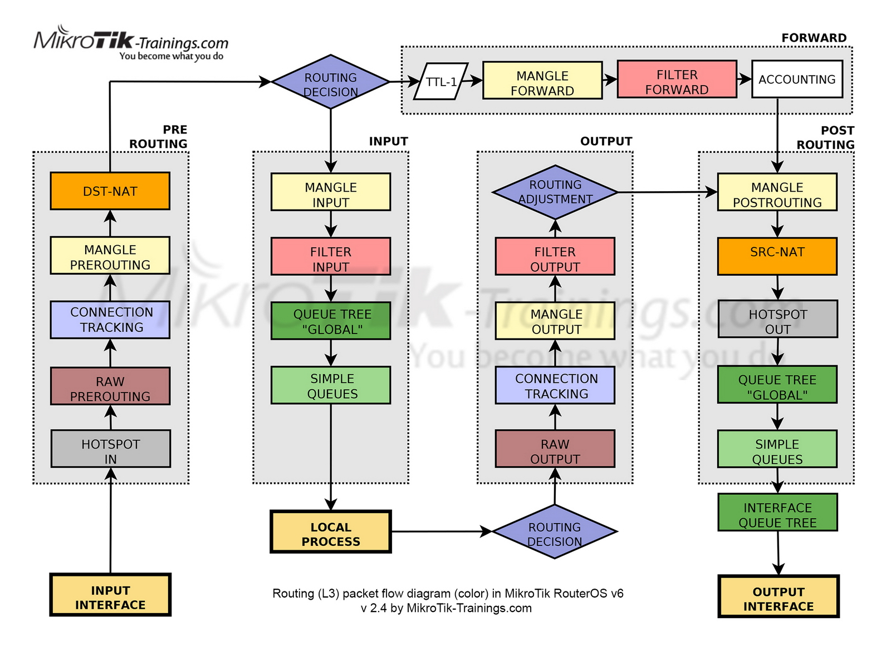

# 🎛️ Mikrotik


## Vlan Bridge

Ketika sudah di routing, tagged vlan akan tetap tembus walapun beda networkg

### Untagged / Access Vlan

Dalam mikrotik terdapat beberapa cara untuk untagged vlan pada interface tertentu.&#x20;

#### Menggunakan  Bridge Port

Salah satu caranya adalah menggunakan bridge port. Ketika menggunakan bridge maka interface vlan dan ether yang akan di unttaged akan dimasukan ke dalam bridge yang sama.

* Buat vlan baru dan tambahkan pada interface masuk/upstream
* Buat bridge baru
* Tambahkan port interface vlan dan interface yang mau di unttaged atau dikasih access pada interface Bridge yang baru dibuat.

#### Menggunakan  Bridge Filtering

Menggunakan bridge filtering, tidak perlu dilakukan pembuatan interface vlan pada mikrotik. Vlan id akan langsung di tag langsung pada port interface pada bridge. Pada jenis kongfigurasi in, akan di aktifkan ingres filtering pada bridge. Ketika mengaktifkan ingres filtering maka secara otomatis mikrotik tidak dapat diakses kembali. Oleh sebab itu akan dibuatkan sebuah vlan untuk management pada bridge interface yang digunakan.

Berikut cara membuat uttaged/access vlan menggunakan bridge filtering&#x20;

*   Skenario

    Terdapat 2 buah vlan. Ya itu vlan 100 sebagai vlan service hotpsot dan vlan 90 sebagai vlan management. Eth 1 sebagai trunk interface dan eth2 sebagai access port.
* Buat sebuah interface bridge baru dengan nama BR-Lokal
* Tambahkan interface eth1 sebagai trunk dan interface 2 sebagai access port vlan
*   Pada bridge port eth2&#x20;

    Vlan :&#x20;

    Pvid : 100

    Frame Types : admit only unttaged and priority tagged
* Pada setiap bridge interface port hilangkan hardware load. Ini berfungsi agar akses bridge tidak diambil ahli oleh switch chip.
*   Masuk ke tab VLAN lalu setting sesuai ketentuan berikut :&#x20;

    Tambah Bridge Vlan&#x20;

    Bridge : BR-Hotspot

    Vlan ID : 100

    Tagged : eth1

    Untagged : eth2
*   Kemudian tambah Bridge Vlan management dengan ketentuan sebagai berikut :&#x20;

    Bridge : BR-Hotpsot

    Vlan id : 90

    Tagged : eth1, BR-Hotspot

    Uttaged : -

    Untuk uttaged port biarkan kosong.
* Buat vlan managemet vlan 90 dan tambahkan pada interface BR-Hotspot.
* Kemudian masuk ke interface BR-Hotspot. Centang atau aktifkan Vlan Filtering. Langkah ini harus dilakukan terkahir kali. Karena ketika mengaktifkan vlan filtering maka router tidak akan bisa diakses lagi. Oleh karena itu wajib membuat vlan management baru mengaktifkan vlan filtering pada interface BR-Hotspot.
*

## Wireless

## Blokir

### Memblokir alamat tertentu

#### Blokir ping ke IP Tertentu

Untuk memblokir **ping** (ICMP request) ke alamat **8.8.8.8** dari jaringan lokal di perangkat **Mikrotik**, Anda bisa menggunakan fitur **firewall filter**. Berikut langkah-langkahnya:

1. **Buka Winbox** atau akses Mikrotik melalui terminal.
2. **Buat rule di firewall** untuk memblokir ICMP ke 8.8.8.8:
   * Jika menggunakan **Winbox**:
     1. Masuk ke **IP** → **Firewall**.
     2. Pada tab **Filter Rules**, klik tombol **+** untuk menambah rule baru.
     3. Pada tab **General**:
        * **Chain**: pilih `forward` (karena ping dari lokal ke luar jaringan).
        * **Protocol**: pilih `icmp`.
        * **Dst. Address**: isi dengan `8.8.8.8`.
     4. Pada tab **Action**:
        * **Action**: pilih `drop`.
   *   Jika menggunakan **Terminal** (CLI), Anda bisa menjalankan perintah berikut:

       
       ```bash
       /ip firewall filter add chain=forward protocol=icmp dst-address=8.8.8.8 action=drop
       ```
       
3. **Cek dan pastikan** rule sudah aktif dan berada di posisi yang tepat (biasanya di bagian atas chain `forward` agar diproses lebih awal).
4. **Tes hasilnya** dengan melakukan ping dari perangkat lokal ke **8.8.8.8**. Jika konfigurasi benar, ping tidak akan berhasil karena diblokir oleh firewall.

Dengan langkah ini, semua ping dari jaringan lokal ke **8.8.8.8** akan terblokir oleh perangkat Mikrotik.


## Firewall

### Firewall Rule

1. **Chain**:
   * **Forward**: Digunakan untuk memfilter paket yang melewati router, misalnya dari LAN ke WAN.
   * **Input**: Digunakan untuk memfilter paket yang ditujukan ke router itu sendiri.
   * **Output**: Digunakan untuk memfilter paket yang berasal dari router dan menuju ke luar jaringan.
2. **Src. Address**:
   * Ini adalah alamat IP sumber (Source) dari paket yang akan difilter. Bisa Anda isi jika ingin memfilter paket dari alamat IP tertentu (misalnya, dari jaringan lokal).
3. **Dst. Address**:
   * Ini adalah alamat IP tujuan (Destination) dari paket. Misalnya, jika ingin memblokir atau mengizinkan akses ke alamat tertentu, seperti **8.8.8.8**.
4. **Protocol**:
   * Di sini Anda dapat memilih protokol yang ingin difilter. Misalnya, **ICMP** untuk memblokir ping, atau protokol lain seperti TCP/UDP.
5. **In. Interface / Out. Interface**:
   * **In. Interface**: Interface dari mana paket datang. Misalnya, interface lokal (LAN) atau interface internet (WAN).
   * **Out. Interface**: Interface ke mana paket keluar.
6. **Action** (Belum terlihat di gambar ini, ada di tab lain):
   * Pada tab **Action**, Anda dapat memilih tindakan yang akan diambil terhadap paket, seperti `drop` (membuang paket) atau `accept` (mengizinkan paket).

#### Contoh Penggunaan:

Jika ingin \*\*memblokir semua ping (ICMP request) dari jaringan lokal ke alamat **8.8.8.8** (misalnya, server DNS Google), ikuti langkah-langkah berikut:

1. **Buat firewall rule**:
   * Chain: **forward** (karena paket melewati router).
   * Protocol: **ICMP** (karena kita ingin memblokir ping).
   * Dst. Address: **8.8.8.8** (alamat tujuan yang akan diblokir).
   * In. Interface: interface lokal (misalnya **ether1**, tergantung topologi jaringan).
   * Out. Interface: interface yang menuju internet (misalnya **pppoe-out1**).
2. **Pilih Action**:
   * Pergi ke tab **Action**, lalu pilih **drop** untuk memblokir paket.

#### Studi Kasus:

**Studi Kasus 1: Memblokir Ping ke DNS Google**

Perusahaan Anda menggunakan DNS internal dan tidak ingin karyawan atau perangkat melakukan ping ke DNS eksternal seperti **8.8.8.8**. Dalam hal ini, Anda dapat menggunakan rule firewall untuk memblokir semua akses ping dari jaringan lokal ke **8.8.8.8**.

**Solusi**: Dengan membuat rule firewall seperti contoh di atas, semua paket ICMP (ping) dari jaringan lokal yang menuju **8.8.8.8** akan diblokir. Ini memastikan karyawan tidak dapat melakukan ping ke alamat DNS tersebut, yang juga dapat membantu keamanan.

**Studi Kasus 2: Mengontrol Lalu Lintas TCP dari Sumber Tertentu**

Anda dapat menggunakan pengaturan yang serupa untuk memblokir atau mengizinkan akses dari sumber alamat IP tertentu. Misalnya, Anda ingin memblokir akses dari komputer dengan IP **192.168.1.50** ke internet melalui protokol TCP.

**Solusi**:

* Chain: **forward**.
* Src. Address: **192.168.1.50**.
* Protocol: **TCP**.
* Out. Interface: interface WAN.
* Action: **drop**.

Dengan rule ini, komputer dengan IP **192.168.1.50** tidak dapat mengakses internet menggunakan protokol TCP.


## Traffic Flow Mikrotik

<figure><figcaption></figcaption></figure>

Gambar yang Anda kirimkan adalah **Routing (L3) Packet Flow Diagram** di Mikrotik RouterOS v6, yang memperlihatkan bagaimana proses penanganan paket jaringan di dalam router Mikrotik dari saat paket masuk hingga keluar melalui berbagai tahap.

#### Penjelasan Detail Gambar:

1. **Input Interface**:
   * Paket masuk ke router melalui interface fisik. Proses dimulai dari sini.
2. **Pre-Routing**:
   * **Hotspot In**: Jika router memiliki Hotspot, semua paket yang melewati interface akan melalui modul Hotspot terlebih dahulu.
   * **Raw Prerouting**: Tahap di mana firewall raw bisa diterapkan untuk menangani paket sebelum diproses lebih lanjut.
   * **Connection Tracking**: Mengecek apakah paket sudah merupakan bagian dari koneksi yang ada.
   * **Mangle Prerouting**: Digunakan untuk menandai paket berdasarkan aturan yang sudah ditentukan.
   * **DST-NAT (Destination NAT)**: Jika paket membutuhkan translasi NAT (misalnya menuju server internal), proses ini akan terjadi di sini.
3. **Routing Decision**:
   * Setelah pre-routing, router akan mengambil keputusan untuk menentukan apakah paket perlu diproses lebih lanjut (local processing) atau diteruskan ke tujuan (forwarding).
4. **Input**:
   * Jika paket ditujukan untuk router itu sendiri (misalnya untuk akses ke IP router), ia akan memasuki jalur **Input**.
     * **Mangle Input**: Marking paket yang masuk ke router.
     * **Filter Input**: Memfilter paket yang menuju router berdasarkan aturan firewall.
     * **Queue Tree "Global"** dan **Simple Queues**: Pengaturan bandwidth global di sini.
   * **Local Process**: Paket yang telah diproses oleh router (misalnya, paket yang meminta DNS resolver router) akan dilanjutkan ke **Local Process**.
5. **Output**:
   * Paket yang dihasilkan oleh router sendiri (misalnya, ICMP reply atau data dari router) akan melalui jalur ini.
     * **Routing Adjustment**: Penyesuaian routing jika ada perubahan rute.
     * **Filter Output**: Memfilter paket yang keluar dari router berdasarkan aturan firewall.
     * **Mangle Output**: Menandai paket yang dihasilkan oleh router.
     * **Connection Tracking**: Memonitor koneksi yang ada.
     * **Raw Output**: Menangani paket mentah yang keluar.
6. **Forward**:
   * Paket yang tidak ditujukan untuk router tetapi melewati router (misalnya dari LAN ke WAN) akan masuk ke jalur **Forward**.
     * **Mangle Forward**: Menandai paket saat diteruskan.
     * **Filter Forward**: Memfilter paket yang melewati router.
     * **Accounting**: Modul untuk memonitor penggunaan bandwidth.
7. **Post-Routing**:
   * Paket yang keluar dari router akan melalui proses ini:
     * **Mangle Postrouting**: Marking paket setelah routing keputusan dilakukan.
     * **SRC-NAT (Source NAT)**: Jika router menerapkan NAT untuk paket yang akan keluar, SRC-NAT dilakukan di sini.
     * **Hotspot Out**: Jika Hotspot diaktifkan, paket akan melalui modul ini sebelum keluar.
     * **Queue Tree "Global"** dan **Simple Queues**: Pengaturan bandwidth untuk paket yang akan keluar.
     * **Interface Queue Tree**: Pengaturan antrian untuk bandwidth di interface output.
8. **Output Interface**:
   * Paket dikirim ke tujuan melalui interface fisik setelah melalui seluruh tahapan ini.

#### Contoh Studi Kasus: Memblokir Ping ke DNS Google (8.8.8.8)

**Studi Kasus:**

Misalkan Anda ingin memblokir akses **ping** (ICMP request) dari jaringan lokal ke alamat **8.8.8.8** (DNS Google) untuk meningkatkan keamanan dan membatasi akses pengguna jaringan.

1. **Pre-Routing**:
   * Paket dari jaringan lokal masuk melalui **Input Interface** dan langsung menuju ke tahap **Pre-Routing**.
   * Pada **Mangle Prerouting**, kita dapat membuat rule untuk menandai paket yang berasal dari jaringan lokal dengan protokol ICMP dan alamat tujuan **8.8.8.8**.
   * **Connection Tracking** akan memeriksa apakah ini adalah bagian dari koneksi yang sudah ada.
2. **Routing Decision**:
   * Router mengambil keputusan apakah paket tersebut ditujukan ke router atau diteruskan. Karena ini paket dari lokal ke internet, paket diteruskan.
3. **Forward**:
   * Paket masuk ke jalur **Forward**, di mana kita dapat menerapkan **Filter Forward** untuk memblokir paket ICMP (ping) ke **8.8.8.8**.
   * Di tahap **Mangle Forward**, kita dapat menandai paket tersebut dan mengidentifikasi paket yang sesuai dengan kriteria.
4. **Post-Routing**:
   * Setelah diproses di jalur forward, paket akan melalui proses **Post-Routing**.
   * Di sini, jika ada aturan NAT, proses SRC-NAT akan dilakukan sebelum paket diteruskan keluar.
5. **Output Interface**:
   * Jika tidak ada aturan lain yang memblokir, paket akan dikirim ke alamat tujuan melalui **Output Interface**.

**Detail Rule:**

* **Mangle Prerouting**:
  * Tandai paket ICMP dengan tujuan **8.8.8.8**.
* **Filter Forward**:
  * Tambahkan rule di **Filter Forward** untuk memblokir paket ICMP yang ditujukan ke **8.8.8.8**.

Dengan aturan ini, setiap kali ada perangkat dari jaringan lokal yang mencoba melakukan ping ke **8.8.8.8**, paket akan diblokir di tahap forward.

#### Kesimpulan:

Diagram aliran paket ini sangat penting untuk memahami bagaimana Mikrotik menangani dan memproses paket di berbagai tahap. Dengan pemahaman ini, kita dapat mengatur firewall, NAT, dan pengaturan routing lainnya dengan lebih efektif.
